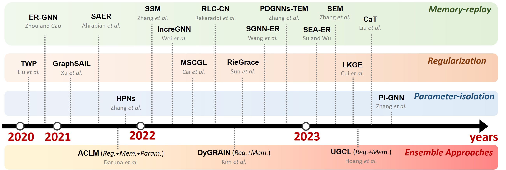

# Survey-of-Continual-Learning-on-Graphs
Official website for "Continual Learning on Graphs: Challenges, Solutions, and Opportunities"

This repository is activately maintained by [*Xikun ZHANG*](https://github.com/imZHANGxikun) from ***The University of Sydney***. As this research topic has recently gained significant popularity, with new articles emerging daily, we will update our repository and survey regularly.

If you find some ignored papers, **feel free to *create pull requests*, *open issues*, or *email* [*Xikun ZHANG*](xzha0505@uni.sydney.edu.au). <br/> 

Please consider [citing](#citation) our survey paper if you find it helpful :), and feel free to share this repository with others! 

## Citation

```

```

## Motivation and Contribution

Continual learning on graph data has recently garnered significant attention for its aim to resolve the catastrophic forgetting problem on existing tasks while adapting the existing model to newly emerged graph tasks. While there have been efforts to summarize progress on continual learning research over Euclidean data, such as images and texts, a systematic review of continual graph learning (CGL) works is still absent. Graph data are far more complex in terms of data structures and application scenarios, making CGL task settings, model designs, and applications extremely complicated.

To address this gap, we provide a comprehensive review of existing CGL works by:
1) Elucidating the different task settings and categorizing the existing works based on their adopted techniques. 
3) Reviewing the benchmark works that are crucial to CGL research. 
4) Discussing the remaining challenges and propose several future directions.

<br/>

|[](image.jpg) |
|:--:|
| *Figure 1: Timeline of the Works Introduced in Our Survey* |

<br/>


  
## Continual Graph Learning Tutorials
1. **Continual Graph Learning (SDM2023)** [link](https://www.siam.org/conferences/cm/program/minitutorials/sdm23-minitutorials) [project page](https://queuq.github.io/CGL_tut/)
  
1. **Continual Graph Learning (WWW2023)** [link](https://www2023.thewebconf.org/program/tutorials/) [project page](https://queuq.github.io/CGL_tut01/)

2. **Continual Learning on Graphs: Challenges, Solutions, and Opportunities** [project page](https://queuq.github.io/CGL_AAAI2024/)


## Continual Graph Learning Benchmarks
1. **CGLB: Benchmark tasks for continual graph learning (2022)** [paper](https://proceedings.neurips.cc/paper_files/paper/2022/hash/548a41b9cac6f50dccf7e63e9e1b1b9b-Abstract-Datasets_and_Benchmarks.html)
2. **Catastrophic forgetting in deep graph networks: an introductory benchmark for graph classification (2021)** [paper](https://arxiv.org/abs/2103.11750)


## Continual Graph Learning Works

### Regularization based

1. **GraphSAIL: Graph Structure Aware Incremental Learning for Recommender Systems** [arxiv](https://arxiv.org/abs/2008.13517) [ACM CIKM](https://dl.acm.org/doi/10.1145/3340531.3412754)

1. **Overcoming Catastrophic Forgetting in Graph Neural Networks** [arxiv link](https://arxiv.org/pdf/2012.06002.pdf) [AAAI link](https://ojs.aaai.org/index.php/AAAI/article/view/16602/16409) [GitHub](https://github.com/hhliu79/TWP)

1. **Self-Supervised Continual Graph Learning in Adaptive Riemannian Spaces** [arxiv](https://arxiv.org/abs/2211.17068) [AAAI](https://ojs.aaai.org/index.php/AAAI/article/view/25586/25358)

4. **Multimodal Continual Graph Learning with Neural Architecture Search** [link](https://dl.acm.org/doi/10.1145/3485447.3512176)

2. **Lifelong Embedding Learning and Transfer for Growing Knowledge Graphs** [arxiv](https://arxiv.org/abs/2211.15845) [AAAI](https://ojs.aaai.org/index.php/AAAI/article/view/25539/25311)
   
### Memory-replay based

1. **Overcoming Catastrophic Forgetting in Graph Neural Networks with Experience Replay** [arxiv link](https://arxiv.org/pdf/2003.09908.pdf) [AAAI link](https://ojs.aaai.org/index.php/AAAI/article/view/16602/16409)

3. **Ricci Curvature-Based Graph Sparsification for Continual Graph Representation Learning** [IEEE TNNLS early access](https://ieeexplore.ieee.org/abstract/document/10225445)

4. **Towards Robust Inductive Graph Incremental Learning via Experience Replay** [arxiv](https://arxiv.org/abs/2302.03534)

7. **Structure Aware Experience Replay for Incremental Learning in Graph-based Recommender Systems** [ACM CIKM](https://dl.acm.org/doi/10.1145/3459637.3482193)

8. **Streaming Graph Neural Networks with Generative Replay** [pdf](https://arxiv.org/pdf/2009.10951.pdf) [ACM KDD](https://dl.acm.org/doi/abs/10.1145/3534678.3539336)

11. **Sparsified Subgraph Memory for Continual Graph Representation Learning** [pdf](https://songdj.github.io/publication/icdm-22/icdm-22.pdf) [IEEE ICDM](https://ieeexplore.ieee.org/document/10027629) 

1. **Topology-aware Embedding Memory for Learning on Expanding Networks** [arxiv](https://arxiv.org/abs/2401.13200)

9. **IncreGNN: Incremental Graph Neural Network Learning by Considering Node and Parameter Importance** [springer](https://link.springer.com/chapter/10.1007/978-3-031-00123-9_59)

10. **CaT: Balanced Continual Graph Learning with Graph Condensation** [arxiv](https://arxiv.org/abs/2309.09455)
   
### Parameter-isolation based

1. **Hierarchical prototype networks for continual graph representation learning** [arxiv](https://arxiv.org/abs/2111.15422) [IEEE TPAMI](https://ieeexplore.ieee.org/document/9808404)

1. **Continual Learning on Dynamic Graphs via Parameter Isolation** [arxiv](https://arxiv.org/abs/2305.13825)

### Miscellaneous

1. **Multimodal Continual Graph Learning with Neural Architecture Search** [pdf](https://mn.cs.tsinghua.edu.cn/xinwang/PDF/papers/2022_Multimodal%20Continual%20Graph%20Learning%20with%20Neural%20Architecture%20Search.pdf) [ACM WWW](https://dl.acm.org/doi/10.1145/3485447.3512176)

5. **DyGRAIN: An Incremental Learning Framework for Dynamic Graphs** [pdf](https://www.ijcai.org/proceedings/2022/0438.pdf)

6. **Continual Learning of Knowledge Graph Embeddings** [arxiv](https://arxiv.org/abs/2101.05850)

10. **Reinforced Continual Learning for Graphs** [arxiv](https://arxiv.org/abs/2209.01556) [ACM CIKM](https://dl.acm.org/doi/abs/10.1145/3511808.3557427)

1. **Disentangle-based Continual Graph Representation Learning** [pdf](https://aclanthology.org/2020.emnlp-main.237v2.pdf)

1. **Lifelong Learning of Graph Neural Networks for Open-World Node Classification** [paper](https://arxiv.org/pdf/2006.14422.pdf) [openreview link](https://openreview.net/forum?id=lfJpQn3xPV-)

3. **Graph Neural Networks with Continual Learning for Fake News Detection from Social Media** [paper](https://arxiv.org/pdf/2007.03316.pdf)
   Combined GCN with existing continual learning techniques like some regularizations

4. **Universal Graph Continual Learning** [TMLR](https://openreview.net/forum?id=wzRE5kTnl3)

#### Table 1: Summarization of different CGL techniques
<sub>The data type **TS** denotes general time series, **ST** denotes spatial-temporal time series, the prefix **M-** indicates multi-modal inputs. ***Q*** denotes direct query the whole LLMs for output, ***T*** denotes the design of time series tokenization, ***P*** indicates the design of textual or parameterized time series prompts, ***FT*** indicates if the parameters of LLMs are updated (fine-tuned), ***I*** indicates if LLMs are integrated as part of the final model for downstream tasks. *Code availability is assessed on January 31st, 2024.* </sub> 
| <sub>**Method**</sub> | <sub> Applications </sub> | <sub>Task Granularity</sub> | <sub>Technique</sub> | <sub>Characteristics</sub> | 
|:--------:|:-----:|:--------:|:------:|:-------:|
| <sub>[TWP](https://arxiv.org/abs/2401.13200)</sub> | <sub>General</sub> | <sub>Node/Graph</sub> | <sub>Reg.</sub> | </sub> Preserve the topology learnt from previous tasks|
|<sub>[RieGrace](https://ojs.aaai.org/index.php/AAAI/article/view/25586/25358) </sub> | <sub> General </sub> | <sub> Node </sub> | <sub> Reg. </sub> | <sub> Maintain previous knowledge via knowledge distillation |
|<sub>[GraphSAIL](https://arxiv.org/abs/2008.13517)  </sub> | <sub> Recommender Systems </sub> | <sub> Node </sub> | <sub> Reg. </sub> | <sub> Local and global structure preservation, node information preservation  |
|<sub>[MSCGL](https://dl.acm.org/doi/10.1145/3485447.3512176)  </sub> | <sub> General </sub> | <sub> Node </sub> | <sub> Reg. </sub> | <sub> Parameter changes orthogonal to previous parameters |
|<sub>[LKGE](https://arxiv.org/abs/2211.15845) </sub> | <sub>  Knowledge Graph </sub> | <sub> Node  </sub> | <sub> Reg. </sub> | <sub> Alleviating forgetting issue with l2 regularization |
|<sub>[ER-GNN](https://arxiv.org/pdf/2003.09908.pdf)  </sub> | <sub> General </sub> | <sub> Node </sub> | <sub> Mem. </sub> | <sub> Replay representative nodes  |
|<sub>[SSM](https://ieeexplore.ieee.org/document/10027629)  </sub> | <sub> General </sub> | <sub> Node </sub> | <sub> Mem. </sub> | <sub> Replay representative sparsified computation subgraphs |
|<sub>[SEM](https://ieeexplore.ieee.org/abstract/document/10225445) </sub> | <sub> General </sub> | <sub> Node </sub> | <sub> Mem. </sub> | <sub> Sparsify computation subgraphs based on information bottleneck |
|<sub>[PDGNNs-TEM](https://arxiv.org/abs/2401.13200)  </sub> | <sub>General </sub> | <sub> Node </sub> | <sub> Mem. </sub> | <sub> Replay representative topology-aware embeddings |
|<sub>[IncreGNN](https://link.springer.com/chapter/10.1007/978-3-031-00123-9_59)  </sub> | <sub> General </sub> | <sub> Node </sub> | <sub> Mem. </sub> | <sub> Replay nodes according to their influence|
|<sub>[RLC-CN](https://arxiv.org/abs/2209.01556)  </sub> | <sub>General </sub> | <sub> Node </sub> | <sub> Mem. </sub> | <sub> Model structure adaption and dark experience replay |
|<sub>[SGNN-ER](https://arxiv.org/pdf/2009.10951.pdf)  </sub> | <sub> General </sub> | <sub> Node  </sub> | <sub> Mem. </sub> | <sub> Model retraining with generated fake historical data |
|<sub>[SAER](https://dl.acm.org/doi/10.1145/3459637.3482193)  </sub> | <sub> Recommender System </sub> | <sub> Node </sub> | <sub> Mem. </sub> | <sub> Buffer the representative user-item pairs based on reservoir sampling|
|<sub>[SEA-ER](https://arxiv.org/pdf/2302.03534.pdf) </sub> | <sub>  General </sub> | <sub> Node  </sub> | <sub> Mem. </sub> | <sub> Minimize the structural difference between the memory buffer and the original graph|
|<sub>[CaT](https://arxiv.org/abs/2309.09455) </sub> | <sub>  General </sub> | <sub> Node  </sub> | <sub> Mem. </sub> | <sub> Train the model solely on balanced condensed graphs from all tasks |
|<sub>[HPNs](https://ieeexplore.ieee.org/document/9808404)  </sub> | <sub>  General </sub> | <sub> Node  </sub> | <sub> Para. </sub> | <sub> Extracting and storing basic features to encourage knowledge sharing across tasks, model expanding to accommodate new patterns |
|<sub>[PI-GNN](https://arxiv.org/abs/2305.13825)  </sub> | <sub>  General </sub> | <sub> Node  </sub> | <sub> Para. </sub> | <sub> Separate parameters for encoding stable and changed graph parts  |
|<sub>[DyGRAIN](https://www.ijcai.org/proceedings/2022/0438.pdf)  </sub> | <sub>  General </sub> | <sub> Node  </sub> | <sub> Mem.+Reg. </sub> | <sub> Alleviate catastrophic forgetting and concept shift of previous task nodes via memory replay and knowledge distillation |
|<sub>[ACLM](https://arxiv.org/abs/2101.05850) </sub> | <sub>  Knowledge Graph </sub> | <sub> Node  </sub> | <sub> Mem.+Reg.+Para. </sub> | <sub> Adapting general CL techniques to CGL tasks  |
|<sub>[UGCL](https://openreview.net/forum?id=wzRE5kTnl3) </sub> | <sub>  General </sub> | <sub> Node/Graph  </sub> | <sub> Mem.+Reg. </sub> | <sub> local/global structure preservation|
